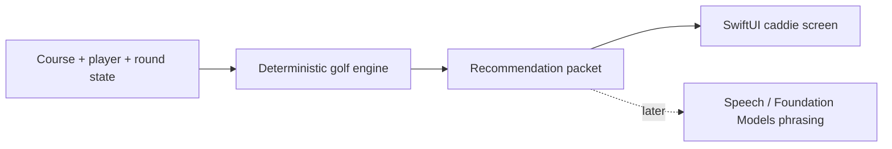

# The Caddie

The Caddie is a clean-start iOS golf caddie project. The app's domain logic is the caddie brain: it owns club, target, risk, and strategy decisions from structured course, player, shot, and round context.

AI and speech layers can later sit on top of the recommendation packet, but they do not choose the golf advice.



## First Slice

- Swift package domain core.
- Tiny embedded sample course/player context.
- Deterministic recommendation packet and fallback phrasing.
- Minimal SwiftUI screen after the domain packet is stable.

See `docs/plans/2026-06-15-001-feature-native-caddie-core-plan.md`.

## Verification

Run Swift package tests when Swift tooling is available:

```powershell
swift test
```
