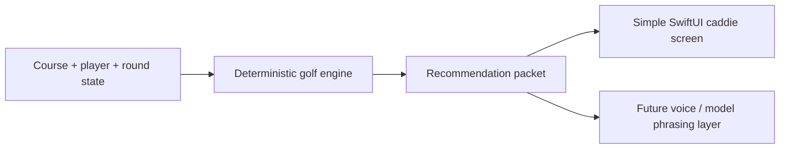

# Native Caddie Core

## Problem Frame
The current TrueCaddie prototype proved that live golf context, round state, and voice guidance are valuable, but it also mixed deterministic golf logic with experimental realtime voice infrastructure. The fresh project should start from a simpler premise: the app is the caddie brain, and AI or speech layers are presentation layers on top of grounded golf decisions.

The first slice should create a reliable, testable caddie core that can answer "what should I hit here?" from structured course, player, shot, and round context without relying on a model to invent golf strategy.

## Requirements

**Grounded Golf Brain**
- R1. The app must treat deterministic domain logic as the source of truth for club, target, risk, and shot recommendation decisions.
- R2. The first slice must support a structured shot context including current hole, par, distance remaining, lie, player club distances, strategy preference, and wind when available.
- R3. The recommendation output must be a structured packet with at least club, target, distance basis, primary reason, risk note, and confidence/status flags.
- R4. The app must be able to produce useful guidance without any language model or network service.

**Initial Product Experience**
- R5. The first UI should be a compact native caddie screen focused on the current hole, current distance, recommendation, and simple round update actions.
- R6. The UI must avoid explicit "connect" or voice-session concepts in the player-facing flow.
- R7. The first experience should prioritize clarity on course over debugging depth; inspector/debug affordances can exist later but should not dominate the main screen.
- R8. The first UI must cover the basic on-course states: ready with recommendation, no course/shot loaded yet, missing distance or lie, and recommendation unavailable.

**AI and Voice Boundaries**
- R9. Apple Speech, Foundation Models, and speech synthesis should be treated as replaceable layers above the recommendation packet, not as the source of golf decisions.
- R10. Foundation Models may later rewrite or explain grounded recommendations in natural caddie language, but must not independently choose clubs, hazards, wind adjustments, or risk strategy.
- R11. The app must have a deterministic fallback response style for devices or regions where Apple Intelligence features are unavailable.

**Clean Start**
- R12. The new project should not copy the prototype wholesale; it should selectively port concepts and domain lessons only when they serve the fresh architecture.
- R13. The initial scope should avoid OpenAI realtime/WebRTC code, quota handling, prompt-heavy caddie behavior, and manual connection state UI.

## Success Criteria
- A golfer can open the app, see the current hole context, and get a plausible grounded recommendation from local logic.
- The recommendation can be tested without microphone, network, or model availability.
- The architecture makes it obvious where future Apple Speech, Foundation Models, and AVSpeechSynthesizer layers plug in.
- The first slice feels simpler than the prototype rather than like a renamed copy.

## Scope Boundaries
- No live voice loop in the first slice.
- No Foundation Models implementation in the first slice.
- No OpenAI realtime migration in the first slice.
- No full scoring/statistics system beyond the minimum round state needed for current-shot guidance.
- No speculative multi-course publishing pipeline unless needed to demo the native caddie core.

## Key Decisions
- Start with native caddie core: This creates a stable golf brain before adding speech or model phrasing.
- Make AI a presentation layer: This keeps exact golf advice controlled, testable, and safer on course.
- Keep a deterministic fallback: Apple Intelligence availability depends on device, region, OS, and user settings, so the core product cannot require it.
- Use the old project as reference only: The prototype contains useful lessons but also accumulated experimental complexity.

## Dependencies / Assumptions
- The first development target is iOS/SwiftUI.
- The fresh project folder is intentionally separate from the prototype.
- Existing TrueCaddie course and recommendation concepts are available as reference material, but not automatically copied.

## Outstanding Questions

### Resolve Before Planning
- None.

### Deferred to Planning
- [Affects R2][Technical] Decide whether the first slice uses a tiny embedded sample course, a ported course bundle, or hand-authored fixture data.
- [Affects R5][Technical] Decide whether to scaffold as an Xcode app project immediately or start with a Swift package/domain core plus app shell.
- [Affects R9][Needs research] Confirm the minimum OS/device availability strategy for Foundation Models before implementing the AI phrasing layer.

## Next Steps
-> /ce:plan for structured implementation planning
