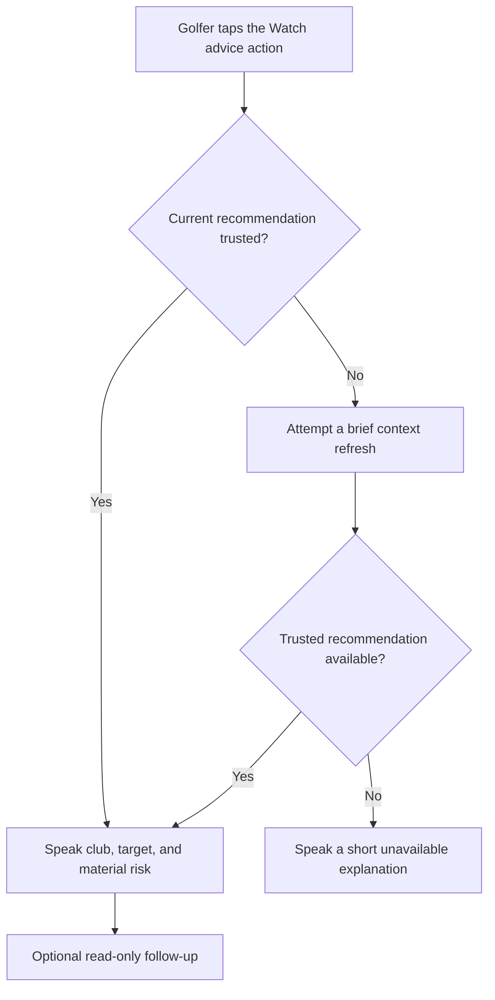

# Hands-Free Caddie

## Problem Frame

TheCaddie should feel like a caddie walking beside the golfer, not like a phone app that must be handled before every shot. During an active round, the golfer should be able to request grounded shot advice with one deliberate action on Apple Watch, hear a short useful answer through the active audio route, and optionally ask a bounded follow-up without taking out or unlocking the phone.

The existing deterministic recommendation engine remains the golf brain. Watch, AirPods, Siri, speech synthesis, and optional Foundation Models are interaction and presentation layers over the current trusted recommendation packet.

## Requirements

**Primary Watch Interaction**

- R1. During an active round, one deliberate tap on Apple Watch must request and speak advice for the current shot without requiring the golfer to handle or unlock the iPhone.
- R2. The advice action must be reachable as a primary Watch interaction with no more than one tap once its chosen Watch surface is visible.
- R3. The first version must speak only after an explicit Watch or voice trigger. GPS movement, inferred shot readiness, or arrival near the ball must never cause unsolicited speech.
- R4. Spoken output should use connected headphones such as AirPods when they are the active audio route and otherwise use an appropriate device speaker. The golfer must be able to disable spoken output.

**Grounded Advice and Failure Behavior**

- R5. Every spoken recommendation must originate from the same deterministic `CaddieRecommendationPacket` used by the visual caddie experience. Voice or model layers must not independently choose club, target, risk, wind adjustment, or strategy.
- R6. The app must not present stale, off-hole, low-quality, or otherwise untrusted advice as current. When the current context is not trustworthy, it may attempt a brief bounded refresh; if trust is not restored, it must say that advice is unavailable and why.
- R7. Default advice must be adaptive and concise: club and target, plus at most one materially important risk when relevant. It should normally finish within ten seconds.
- R8. Detailed reasoning must remain available as an explicit follow-up such as “Why?” rather than being included in every response.
- R9. Non-ready states—including no active round, missing context, completed hole, or unavailable recommendation—must produce short actionable speech instead of silence or invented advice.
- R10. Repeating advice for an unchanged packet must preserve the same club, target, and critical risk even when optional model phrasing varies.

**AirPods, Siri, and Follow-Ups**

- R11. A golfer wearing AirPods must be able to invoke TheCaddie through Siri or an equivalent system voice action and hear the same grounded current advice.
- R12. The first voice-command scope is read-only. It may request current advice, distance, repetition, explanation, risk, or a deterministic safer-play comparison.
- R13. Voice must not record shot results, penalties, putts, hole completion, hole selection, or any other round-state mutation in the first version.
- R14. Listening must always be explicitly initiated and bounded. The first version must not keep an always-listening microphone session running.
- R15. A custom app-specific press on the AirPods stem is not required. Activating Siri from AirPods and invoking TheCaddie is the supported AirPods path unless Apple exposes a suitable direct API during implementation.

**Phrasing and Model Availability**

- R16. Deterministic spoken phrasing must be the complete baseline experience and must work without Apple Intelligence, Foundation Models, or network access.
- R17. Apple Foundation Models may optionally rewrite or explain packet-owned advice, but model output must be rejected if it changes, omits, or contradicts the club, target, critical risk, or other protected facts.
- R18. Model unavailability, guardrail rejection, timeout, or generation failure must silently fall back to deterministic phrasing without blocking or delaying already-available advice.
- R19. Normal on-course speech must not expose model/provider terminology or require the golfer to understand why a particular phrasing source was used.

**Reliability, Privacy, and Diagnostics**

- R20. Watch and iPhone must agree on the active round, selected hole, current packet, and packet freshness before advice is spoken.
- R21. A delayed response for an older shot or hole must never play after the active packet has changed.
- R22. When a trusted recommendation is already available to the Watch, tapping for advice should begin the response within two seconds. A refresh path may take longer but must provide prompt audible feedback rather than appearing unresponsive.
- R23. The hands-free experience must not require continuous microphone capture and must minimize avoidable battery use during a round.
- R24. Debug export must identify the trigger source, selected hole, packet identity/freshness, phrasing source, validation result, and fallback reason without retaining raw voice recordings by default.

## Success Criteria

- With an active round and trusted packet, a golfer can request and hear useful advice from Apple Watch while the iPhone remains locked and pocketed.
- The normal response sounds like concise caddie guidance rather than a readout of every available data point.
- A significant risk is spoken when relevant, while longer reasoning is available only on request.
- An AirPods wearer can use Siri to request the same current advice and hear the answer through the active audio route.
- Weak GPS, wrong-hole context, stale state, and missing round context never produce confident but untrusted shot advice.
- Read-only voice requests cannot mutate scoring or round state.
- Devices without available Foundation Models retain the complete deterministic hands-free experience.
- A copied debug report is sufficient to determine what triggered speech, which packet was used, and why deterministic or model phrasing was selected.

## Scope Boundaries

- No proactive or unsolicited advice in the first version.
- No always-listening conversational loop.
- No voice-driven scoring, shot recording, penalties, putting, hole completion, or navigation.
- No general-purpose golf chatbot or open-ended assistant.
- No model-owned golf decisions or direct model mutation of round state.
- No dependency on Foundation Models, Apple Intelligence eligibility, or network availability for core advice.
- No promise of a custom AirPods stem action unless an appropriate public API is verified.
- No requirement for full iPhone feature parity in the Watch app.
- Apple Watch Ultra workout Action-button integration is optional and does not define the baseline experience.

## Key Decisions

- Dedicated hands-free phase: Preserve `docs/brainstorms/2026-06-15-native-caddie-core-requirements.md` as the completed core definition and specify the hands-free product separately.
- Watch tap first: A one-tap Watch action is faster and more dependable in wind and conversation than requiring a spoken question for every shot.
- Adaptive concise response: Club and target are always primary; only material risk earns default airtime, while “Why?” provides depth.
- Explicit triggers only: Predictability and trust outweigh speculative proactive behavior during the first release.
- Read-only voice first: Recognition errors must not corrupt scoring or round state while the interaction is being validated on course.
- AirPods through Siri: Public AirPods controls are oriented around media, calls, listening modes, and Siri, so the product should not depend on an undocumented app-specific stem press.
- Deterministic baseline: Hands-free advice must remain useful on every supported device even when model phrasing is unavailable.

## Dependencies / Assumptions

- The deterministic recommendation packet and spoken fallback remain the source contract, as established in `docs/brainstorms/2026-06-15-native-caddie-core-requirements.md`.
- GPS and round-state trust must pass the decision gate in `docs/plans/2026-06-22-001-feature-gps-round-state-validation-plan.md` before hands-free advice is treated as ready for normal play.
- Optional model phrasing follows `docs/plans/2026-06-22-002-feat-foundation-models-phrasing-plan.md` and remains separate from the domain package.
- The golfer starts and configures the round before relying on hands-free advice; the first version does not need to perform full round setup by voice.
- The target Apple Watch, iPhone, and AirPods combinations require on-device validation because audio routing, background execution, and system voice behavior vary by OS and hardware.

## Alternatives Considered

- Voice question as the primary trigger: More conversational, but slower and less reliable in wind or group conversation than a single Watch tap.
- Proactive advice when the golfer reaches the ball: More hands-free, but too vulnerable to GPS ambiguity and unwanted interruptions for the first version.
- Full voice round control: Higher eventual convenience, but recognition mistakes can damage scoring state; defer until read-only voice has earned trust.
- AirPods button as the primary trigger: Appealing, but current public controls do not provide a dependable arbitrary app-action contract.

## Outstanding Questions

### Resolve Before Planning

- None.

### Deferred to Planning

- [Affects R1-R2][Needs research] Choose the minimum supported iOS/watchOS versions and the best one-tap Watch surface among an interactive complication/widget, a Watch app primary action, or another public system control.
- [Affects R4, R11][Needs research] Validate real audio routing and Siri behavior across Watch, iPhone, and representative AirPods models while the phone is locked.
- [Affects R6, R20-R22][Technical] Define packet identity, freshness, synchronization, bounded refresh, and stale-response cancellation across devices.
- [Affects R11-R14][Technical] Choose the first bounded voice route and supported read-only intents without creating an always-listening session.
- [Affects R12][Technical] Confirm which deterministic safer-play comparisons already exist and define any missing domain capability before exposing that question by voice.
- [Affects R24][Technical] Define diagnostics that are useful for field testing while avoiding raw audio retention.

## Next Steps

-> `/ce:plan` for structured implementation planning
