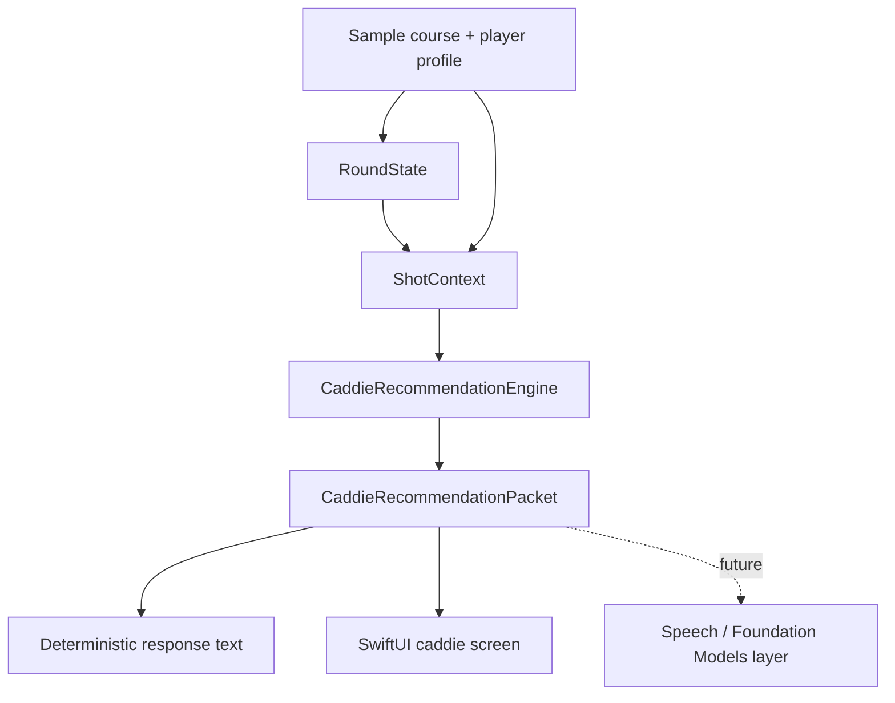

# Native Caddie Core Implementation Plan

## Overview
Build the fresh project around a deterministic caddie core before adding speech or model phrasing. The first slice creates a small Swift domain package, a tiny embedded sample course/player context, a recommendation packet, and a minimal SwiftUI screen that renders the packet and updates simple shot state.

The key product decision from the origin document is preserved: the app chooses club, target, risk, and strategy; future Apple Speech/Foundation Models layers only interpret or phrase grounded results.

## Requirements Trace
- R1. Deterministic domain logic is the source of truth for club, target, risk, and shot decisions.
- R2. Structured shot context includes hole, par, distance, lie, player club distances, strategy preference, and wind when available.
- R3. Recommendation output is a structured packet with club, target, distance basis, primary reason, risk note, and confidence/status flags.
- R4. Guidance works without model or network availability.
- R5. First UI focuses on current hole, distance, recommendation, and simple round update actions.
- R6. No player-facing connect or voice-session UI.
- R7. Main experience prioritizes on-course clarity over debug depth.
- R8. UI covers ready, no course/shot, missing distance or lie, and unavailable recommendation states.
- R9-R11. Speech and AI remain replaceable presentation layers with deterministic fallback.
- R12-R13. Fresh project selectively ports concepts only and avoids OpenAI realtime/WebRTC scaffolding.

## Scope Boundaries
- No live voice loop.
- No Foundation Models implementation.
- No OpenAI realtime/WebRTC migration.
- No full scoring/statistics system beyond minimal current-shot state.
- No multi-course publishing pipeline.

### Deferred to Separate Tasks
- Apple Speech and AVSpeechSynthesizer loop: future voice iteration after packet stability.
- Foundation Models phrasing backend: future AI presentation layer after availability research.
- Real GPS/course detection: future round-state fidelity work after manual/sample context proves the core.

## Context & Research

### Relevant Code and Patterns
- `docs/brainstorms/2026-06-15-native-caddie-core-requirements.md`: origin document and scope source.
- Prototype reference only: `ShotStateContext`, `RoundState`, and `NextShotRecommendationPacket` in the old project proved useful as concepts.
- Prototype anti-patterns to avoid: OpenAI realtime/WebRTC transport, quota/billing failure surfaces, manual connect UI, prompt-heavy caddie behavior.

### Institutional Learnings
- Keep recommendation behavior in the domain layer, not in SwiftUI views.
- Use one packet as the UI and future voice contract.
- Start with deterministic voice-ready phrasing before adding model-generated phrasing.

### External References
- None for the first slice. Foundation Models and Speech availability research is deferred because no AI or speech implementation is in scope.

## Key Technical Decisions
- Start Swift package-first: A package gives fast, isolated domain tests and keeps the golf brain independent from the app shell.
- Use tiny embedded sample data first: Hand-authored fixture data avoids importing the old bundle pipeline before the new domain shape has earned it.
- Create a minimal SwiftUI app shell after the domain compiles: The UI should consume the packet, not create recommendation logic.
- Keep response phrasing deterministic: The same packet should support display text and future spoken fallback without model availability.

## Open Questions

### Resolved During Planning
- First data source: Use a tiny embedded sample course/player fixture rather than porting the old bundle first.
- Project sequencing: Build a Swift package/domain core first, then add the app shell around it.
- Foundation Models availability: Defer research until the AI phrasing layer is actually planned.

### Deferred to Implementation
- Exact Xcode project generation method: The implementer should create a minimal iOS app target that links the domain package when Xcode tooling is available; if working on Windows, create the source structure and document the macOS/Xcode step that could not be verified.
- Visual polish level of the first screen: Keep the screen intentional and on-course clear, but avoid large design investment before the core packet is validated.

## Output Structure

    Package.swift
    Sources/
      TheCaddieDomain/
        Models/
        Recommendation/
        SampleData/
        Presentation/
    Tests/
      TheCaddieDomainTests/
    ios/
      TheCaddie/
        TheCaddieApp.swift
        CaddieScreen.swift
        CaddieViewModel.swift
    docs/
      brainstorms/
      plans/

## High-Level Technical Design

> This illustrates the intended approach and is directional guidance for review, not implementation specification. The implementing agent should treat it as context, not code to reproduce.

The domain package should expose stable, app-facing concepts:
- Course context: course, hole, par, tee length, simple hazards.
- Player context: stock club distances and strategy preference.
- Shot context: shot number, remaining distance, lie, wind.
- Recommendation packet: display/spoken-ready output plus status flags.
- Recommendation engine: pure function from contexts to packet or unavailable status.

## Implementation Units

- [ ] **Unit 1: Repository and package foundation**

**Goal:** Establish a clean Swift package and project documentation without importing old prototype code wholesale.

**Requirements:** R4, R12, R13

**Dependencies:** None

**Files:**
- Create: `Package.swift`
- Create: `Sources/TheCaddieDomain/`
- Create: `Tests/TheCaddieDomainTests/`
- Create: `README.md`
- Create: `AGENTS.md`

**Approach:**
- Create a Swift package named `TheCaddieDomain`.
- Document the clean-start rules in `AGENTS.md`: deterministic golf logic first, AI as presentation, no OpenAI realtime code.
- Keep package dependencies empty unless the implementation environment requires a test helper already available by default.

**Execution note:** Test-first where practical: create at least one failing package test before filling the domain surface.

**Patterns to follow:**
- Conceptual reference from old `ShotStateContext`, `RoundState`, and `NextShotRecommendationPacket`, but do not copy files blindly.

**Test scenarios:**
- Happy path: package test target can import the domain module.
- Error path: package should not require network, credentials, or iOS-only frameworks to run domain tests.

**Verification:**
- Domain package structure exists and can be tested independently of the iOS app when Swift tooling is available.

- [ ] **Unit 2: Domain models and sample context**

**Goal:** Define the minimal model set needed to represent a current shot and one sample playable scenario.

**Requirements:** R1, R2, R4

**Dependencies:** Unit 1

**Files:**
- Create: `Sources/TheCaddieDomain/Models/CourseModels.swift`
- Create: `Sources/TheCaddieDomain/Models/PlayerContext.swift`
- Create: `Sources/TheCaddieDomain/Models/RoundState.swift`
- Create: `Sources/TheCaddieDomain/Models/ShotContext.swift`
- Create: `Sources/TheCaddieDomain/SampleData/SampleRound.swift`
- Test: `Tests/TheCaddieDomainTests/DomainModelTests.swift`

**Approach:**
- Model only what the first recommendation needs: one course, one or two holes, par, tee length, green distances, hazards, clubs, strategy, wind, lie, and shot number.
- Keep round state current-shot focused; avoid full scoring and statistics.
- Include explicit missing-context states rather than relying on optionals to leak into UI behavior.

**Patterns to follow:**
- Old `RoundState` showed useful immutable update behavior and hole-state lookup.
- Old `ShotStateContext` showed the right minimal shot bridge: shot number, remaining distance, lie.

**Test scenarios:**
- Happy path: sample round exposes a current hole with par, distance, lie, strategy, wind, and player clubs.
- Edge case: missing distance is represented as a known missing-context state.
- Edge case: missing lie is represented as a known missing-context state.
- Error path: requesting an unknown hole returns unavailable context instead of crashing.

**Verification:**
- Domain tests prove sample context is complete enough for recommendation and incomplete states are explicit.

- [ ] **Unit 3: Recommendation packet and deterministic engine**

**Goal:** Produce a structured recommendation packet from local context with deterministic fallback phrasing.

**Requirements:** R1, R3, R4, R9, R10, R11

**Dependencies:** Unit 2

**Files:**
- Create: `Sources/TheCaddieDomain/Recommendation/CaddieRecommendationPacket.swift`
- Create: `Sources/TheCaddieDomain/Recommendation/CaddieRecommendationEngine.swift`
- Create: `Sources/TheCaddieDomain/Presentation/CaddieResponseText.swift`
- Test: `Tests/TheCaddieDomainTests/RecommendationEngineTests.swift`
- Test: `Tests/TheCaddieDomainTests/CaddieResponseTextTests.swift`

**Approach:**
- Implement a small deterministic scoring rule for the first slice: choose the closest stock club that safely covers the target window, adjust conservatively for wind, and emit risk notes from known hazards.
- Return a packet with status flags for ready, missing context, and unavailable recommendation.
- Keep natural-language text deterministic and derived from packet fields.
- Do not let UI or future AI layers recalculate club or target.

**Patterns to follow:**
- Old `NextShotRecommendationPacket` proved the value of headline, execution note, miss/risk note, and confidence fields.

**Test scenarios:**
- Happy path: 142m fairway shot with player club distances returns a specific club, target, primary reason, and ready status.
- Edge case: distance between two clubs chooses the safer club according to strategy preference.
- Edge case: helping or hurting wind changes the distance basis or reason deterministically.
- Error path: missing distance returns a missing-context packet and no invented club.
- Error path: no suitable club returns unavailable recommendation with a fallback explanation.
- Integration: deterministic response text uses packet fields and does not mention AI, model, or connectivity.

**Verification:**
- Tests prove the engine works without network/model availability and always returns either a structured packet or explicit unavailable state.

- [ ] **Unit 4: Minimal SwiftUI caddie screen**

**Goal:** Add the first player-facing screen that renders the recommendation packet and allows simple shot-state updates.

**Requirements:** R5, R6, R7, R8, R12, R13

**Dependencies:** Unit 3

**Files:**
- Create or generate: `ios/TheCaddie/TheCaddie.xcodeproj`
- Create: `ios/TheCaddie/TheCaddieApp.swift`
- Create: `ios/TheCaddie/CaddieScreen.swift`
- Create: `ios/TheCaddie/CaddieViewModel.swift`
- Test: `Tests/TheCaddieDomainTests/CaddieViewModelTests.swift`

**Approach:**
- Build the screen around the packet: current hole header, large distance/recommendation card, reason/risk text, and quick lie/result buttons.
- Keep all recommendation decisions in the domain package; the view model only maps packet state to view state and handles simple round updates.
- Show four explicit UI states: ready, no sample loaded, missing distance/lie, and unavailable recommendation.
- Link the iOS app target to `TheCaddieDomain`; if the current environment cannot generate or validate the Xcode project, keep the app source files minimal and call out that project generation needs macOS/Xcode verification.
- Avoid any connect, listening, model, prompt, or provider language in the UI.

**Patterns to follow:**
- Old UI screenshots showed the value of a large distance/recommendation card, but also showed that debug controls and voice status can crowd the on-course flow.

**Test scenarios:**
- Happy path: loaded sample context displays hole, distance, recommended club, target, and reason.
- Edge case: missing distance shows an actionable missing-distance state rather than a misleading recommendation.
- Edge case: missing lie prompts for a lie/update without invoking voice or model concepts.
- Error path: unavailable recommendation shows fallback copy and no club.
- Integration: tapping a lie/result update changes round state and refreshes the packet from the domain engine.

**Verification:**
- The first app screen can be previewed or run with sample data and displays guidance without microphone, network, model, or OpenAI code.

## System-Wide Impact
- **Interaction graph:** Domain package is the source of truth. UI consumes packet and sends simple round updates back through the view model.
- **Error propagation:** Missing or unavailable context should become packet/view states, not thrown errors in the main on-course flow.
- **State lifecycle risks:** Round updates must not silently reset the current hole or distance. Immutable update methods should be preferred.
- **API surface parity:** Future voice and AI layers should consume the same recommendation packet as the UI.
- **Integration coverage:** Unit tests cover domain behavior; view model tests cover packet-to-UI and update flow. Full simulator UI tests can wait until the app shell stabilizes.
- **Unchanged invariants:** No model provider is required to select clubs, targets, hazards, wind adjustments, or strategy.

## Risks & Dependencies

| Risk | Mitigation |
|------|------------|
| The first recommendation rules are too simplistic | Keep the sample narrow, expose confidence/status flags, and make the packet easy to improve without changing UI contracts. |
| The project accidentally reimports prototype complexity | Document clean-start rules in `AGENTS.md` and do not copy OpenAI realtime/WebRTC files. |
| Windows environment lacks Swift/Xcode tooling | Implement and verify the Swift package where possible; for the iOS app target, record any macOS/Xcode generation or simulator verification that could not run. |
| UI becomes a debug inspector again | Limit first screen to player-facing current-shot guidance and keep debug surfaces deferred. |
| Foundation Models assumptions leak into the core | Keep all AI availability research and model phrasing out of the first slice. |

## Documentation / Operational Notes
- `README.md` should explain the clean architecture in one diagram and identify the first slice as deterministic/offline-capable.
- `AGENTS.md` should carry the product rule: AI may phrase recommendations later, but the domain engine owns golf decisions.
- If Swift tooling is unavailable in the active environment, implementation should state exactly which checks could not run.

## Sources & References
- **Origin document:** [docs/brainstorms/2026-06-15-native-caddie-core-requirements.md](../brainstorms/2026-06-15-native-caddie-core-requirements.md)
- Prototype reference concepts: `ShotStateContext`, `RoundState`, `NextShotRecommendationPacket`
