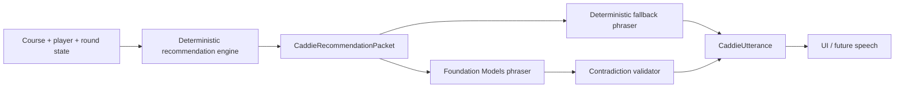

# Foundation Models Caddie Phrasing Layer

## Overview

Add Apple Foundation Models as an optional presentation layer that rewrites and explains grounded recommendations from `CaddieRecommendationPacket`. The deterministic recommendation engine remains the only source of club, target, risk, distance, wind adjustment, strategy, and confidence decisions.

This plan should begin after the GPS and round-state validation plan has produced enough trust in the recommendation packet. The first implementation should improve phrasing and explanation, not create a general chat agent or a model-driven caddie brain.

## Problem Frame

The product direction from `docs/brainstorms/2026-06-15-native-caddie-core-requirements.md` is explicit: The Caddie is the golf brain, and AI or speech layers are presentation layers above grounded decisions. Foundation Models is attractive because it can run on-device, stay private, work offline when available, and use Swift-native concepts such as guided generation, stateful sessions, and tool calling.

The risk is equally clear: if the model is allowed to choose golf advice, the app reintroduces the prototype's prompt drift and ungrounded recommendation problems. This plan keeps Foundation Models in a narrow role: say the known answer better, explain the known answer, and answer natural questions by calling deterministic app tools.

## Requirements Trace

- R1. Deterministic domain logic remains the source of truth for club, target, risk, wind adjustment, and strategy.
- R2. Foundation Models may phrase, summarize, explain, and adapt tone for an already-built recommendation packet.
- R3. The app must keep deterministic fallback phrasing for unsupported devices, disabled Apple Intelligence, model-not-ready states, and generation failures.
- R4. Model output must be validated so it cannot contradict packet-owned fields such as recommended club or target.
- R5. The player-facing experience must not expose prompt mechanics, connection/model status, or provider concepts during normal play.
- R6. Future voice and text surfaces must consume the same packet and phrasing contract.

## Scope Boundaries

- No model-driven club selection, target selection, hazard interpretation, wind adjustment, strategy selection, or score advice.
- No OpenAI realtime, WebRTC, cloud LLM, quota handling, or API-key path.
- No always-on chat surface in the first implementation.
- No live microphone loop in this plan; Apple Speech and AVSpeechSynthesizer can consume the same phrasing contract later.
- No Foundation Models dependency in the domain package; the domain must remain independently testable without iOS 26 runtime APIs.

### Deferred to Separate Tasks

- Apple Speech command recognition and AVSpeechSynthesizer playback: separate voice-loop plan after phrasing is stable.
- Tool-driven "Can I go for it?" comparison UX: later unit or follow-up plan after basic packet phrasing works.
- Private Cloud Compute or third-party model support: future provider abstraction if on-device Foundation Models is insufficient.

## Context & Research

### Relevant Code and Patterns

- `Sources/TheCaddieDomain/Recommendation/CaddieRecommendationPacket.swift` is the structured contract for recommendation status, club, target, distance basis, risk note, confidence, and debug details.
- `Sources/TheCaddieDomain/Presentation/CaddieResponseText.swift` already provides deterministic spoken fallback and display headline generation.
- `Sources/TheCaddieDomain/Presentation/CaddieViewState.swift` maps the packet into UI-facing text, preserving the current "domain decides, presentation renders" boundary.
- `ios/TheCaddie/CaddieViewModel.swift` owns app-shell state, debug export, and current packet access. It is the right place to hold a pluggable phrasing service, not the domain package.
- `docs/plans/2026-06-22-001-feature-gps-round-state-validation-plan.md` remains the active trust-building phase and gates when presentation-layer work should begin.

### Institutional Learnings

- The fresh project intentionally avoided prototype voice/provider complexity and prompt-heavy caddie behavior.
- The domain package should remain Swift-first and independently testable.
- The existing debug export is useful for field validation and should include enough phrasing metadata to diagnose model/fallback differences without crowding the main screen.

### External References

- HackerNoon article: `https://hackernoon.com/a-developers-guide-to-apples-foundation-models-framework-in-ios-26?source=rss`
- Apple WWDC: `https://developer.apple.com/videos/play/wwdc2025/286/`
- Apple WWDC deep dive: `https://developer.apple.com/videos/play/wwdc2025/301/`
- Apple Foundation Models docs: `https://developer.apple.com/documentation/foundationmodels`
- Apple SystemLanguageModel docs: `https://developer.apple.com/documentation/foundationmodels/systemlanguagemodel`

The key research takeaway is that Foundation Models supports on-device language generation, stateful sessions, guided generation, tool calling, and availability checks. Availability must be treated as dynamic: the device may be ineligible, Apple Intelligence may be disabled, or the model may not be ready.

## Key Technical Decisions

- Put Foundation Models behind a replaceable app-shell protocol: This keeps iOS 26 framework availability out of the domain package and makes deterministic fallback the default behavior.
- Start with structured phrasing, not chat: A constrained output object is easier to validate and safer on course than free-form model text.
- Validate against the packet after generation: Any model output that changes or omits required packet-owned advice should be discarded in favor of deterministic fallback.
- Use one short-lived session per phrasing request initially: This avoids context-window drift and makes outputs more predictable. Stateful sessions can be introduced later for natural Q&A.
- Treat model availability as a background capability: The main caddie screen should continue showing deterministic guidance without surfacing technical reasons unless the user opens diagnostics.

## Open Questions

### Resolved During Planning

- Should Foundation Models choose golf advice? No. It may only phrase or explain deterministic packet advice.
- Should this be added to the active GPS plan? No. The GPS plan should remain focused on trust and field validation; this gets its own presentation-layer plan and is gated by recommendation trust.
- Should deterministic fallback remain first-class? Yes. It is required for unavailable model states and for contradiction validation failures.

### Deferred to Implementation

- Exact Foundation Models availability enum shape and compile gates: confirm against the active Xcode/iOS 26 SDK during implementation.
- Whether guided generation alone is sufficient or tool calling is needed for the first release: decide after a small device spike.
- Final player-facing tone controls: start with one concise caddie style, then add style variants only if the first version feels useful.

## High-Level Technical Design

> *This illustrates the intended approach and is directional guidance for review, not implementation specification. The implementing agent should treat it as context, not code to reproduce.*

The Foundation Models layer receives packet facts and returns phrasing only. The validator compares the result against packet-owned facts before any UI or speech surface can use it.

## Implementation Units

- [ ] **Unit 1: Phrasing Contract and Deterministic Baseline**

**Goal:** Create a stable app-facing phrasing contract that both deterministic and model-backed implementations can satisfy.

**Requirements:** R1, R3, R6

**Dependencies:** Existing `CaddieRecommendationPacket` and `CaddieResponseText`

**Files:**
- Create: `ios/TheCaddie/CaddieAdvicePhraser.swift`
- Create: `ios/TheCaddieTests/CaddieAdvicePhraserTests.swift`
- Modify: `ios/TheCaddie/CaddieViewModel.swift`
- Modify as needed: `TheCaddie.xcodeproj/project.pbxproj`
- Test: `ios/TheCaddieTests/CaddieAdvicePhraserTests.swift`
- Test: `Tests/TheCaddieDomainTests/CaddieResponseTextTests.swift`

**Approach:**
- Define an app-shell-level phrasing result that can carry a headline, spoken text, optional explanation, source label, and fallback reason.
- Add a deterministic implementation that wraps `CaddieResponseText.spokenFallback(for:)` and `CaddieResponseText.displayHeadline(for:)`.
- Keep the domain package unchanged except for tests that verify fallback phrasing remains packet-derived.

**Execution note:** Implement behavior test-first where possible; this is the safety baseline for all model failures.

**Patterns to follow:**
- `Sources/TheCaddieDomain/Presentation/CaddieResponseText.swift`
- `Sources/TheCaddieDomain/Presentation/CaddieViewState.swift`

**Test scenarios:**
- Happy path: ready packet with club and target produces the same deterministic advice as today.
- Edge case: missing distance, missing lie, unavailable, and no-course packets produce useful fallback text without model availability.
- Integration: view model can expose phrased advice while the underlying packet values remain unchanged.

**Verification:**
- The app can render and speak deterministic advice through the new phrasing contract without importing Foundation Models.

- [ ] **Unit 2: Foundation Models Adapter and Availability Gate**

**Goal:** Add a model-backed phraser that is only used when Foundation Models is available and safe to call.

**Requirements:** R2, R3, R5

**Dependencies:** Unit 1

**Files:**
- Create: `ios/TheCaddie/FoundationModelCaddieAdvicePhraser.swift`
- Modify: `ios/TheCaddie/CaddieViewModel.swift`
- Modify as needed: `TheCaddie.xcodeproj/project.pbxproj`
- Test: `ios/TheCaddieTests/CaddieAdvicePhraserTests.swift`

**Approach:**
- Isolate all `FoundationModels` framework usage in one iOS app-shell file guarded by SDK/runtime availability.
- Check model availability before attempting generation.
- Return deterministic fallback for unavailable, disabled, model-not-ready, guardrail, timeout, or generation-error cases.
- Do not surface model availability on the main caddie screen; expose it only in debug export or diagnostics.

**Patterns to follow:**
- Existing view-model fallback behavior for GPS availability and debug export
- Apple Foundation Models availability guidance

**Test scenarios:**
- Happy path: available model returns a phrased response that passes validation.
- Error path: unavailable model returns deterministic fallback without blocking the recommendation UI.
- Error path: generation failure returns deterministic fallback and records a diagnostic reason.
- Edge case: concurrent phrasing requests do not corrupt the displayed packet or show stale model text for a newer shot.

**Verification:**
- Unsupported devices and model-not-ready states still show the same recommendation as before.

- [ ] **Unit 3: Structured Output and Contradiction Validation**

**Goal:** Prevent model phrasing from overriding deterministic advice.

**Requirements:** R1, R4, R6

**Dependencies:** Unit 2

**Files:**
- Create or modify: `ios/TheCaddie/CaddieAdvicePhraser.swift`
- Create or modify: `ios/TheCaddie/FoundationModelCaddieAdvicePhraser.swift`
- Test: `ios/TheCaddieTests/CaddieAdvicePhraserTests.swift`
- Test: `Tests/TheCaddieDomainTests/CaddieResponseTextTests.swift`

**Approach:**
- Ask the model for constrained phrasing fields rather than an unconstrained paragraph.
- Validate that required packet-owned values are represented consistently, especially recommended club and target.
- Discard model output when it names a different club, changes target, invents a distance, or removes a critical risk note.
- Prefer deterministic fallback over attempting to "fix" invalid model output after the fact.

**Patterns to follow:**
- Packet-owned values in `CaddieRecommendationPacket`
- Debug club and hazard evaluation output in `CaddieViewModel.debugExportText`

**Test scenarios:**
- Happy path: model text that repeats the packet club and target is accepted.
- Error path: model text that changes `7 Iron` to `8 Iron` is rejected.
- Error path: model text that changes "middle of the green" to "attack the pin" is rejected.
- Edge case: packet without a recommended club uses fallback status text rather than asking the model to invent one.
- Integration: debug export distinguishes deterministic fallback, accepted model phrasing, and rejected model phrasing.

**Verification:**
- No model-generated text can alter the actual recommendation displayed or spoken to the golfer.

- [ ] **Unit 4: Debug and Field Validation Support**

**Goal:** Make model behavior inspectable during testing without crowding the player-facing caddie screen.

**Requirements:** R3, R4, R5

**Dependencies:** Units 1-3

**Files:**
- Modify: `ios/TheCaddie/CaddieViewModel.swift`
- Modify as needed: `ios/TheCaddie/CaddieScreen.swift`
- Update as needed: `docs/field-testing/`
- Test: `ios/TheCaddieTests/CaddieAdvicePhraserTests.swift`

**Approach:**
- Add debug export fields for phrasing source, model availability, fallback reason, model output status, and validation result.
- Keep all Foundation Models diagnostics out of the main recommendation card.
- Use field testing to compare deterministic and model phrasing for clarity, trust, and contradiction risk.

**Patterns to follow:**
- Existing copyable debug export in `CaddieViewModel.debugExportText`
- Current main-screen simplification direction in `docs/plans/2026-06-22-001-feature-gps-round-state-validation-plan.md`

**Test scenarios:**
- Happy path: accepted model output is recorded as model-backed in debug export.
- Error path: unavailable model records fallback reason without user-facing disruption.
- Error path: rejected model output records validation failure and fallback source.

**Verification:**
- A tester can diagnose why model phrasing appeared or did not appear from one copied debug report.

- [ ] **Unit 5: Optional Tool-Calling Spike for Natural Questions**

**Goal:** Explore whether Foundation Models tool calling can answer bounded questions by calling deterministic app logic.

**Requirements:** R1, R2, R4, R6

**Dependencies:** Units 1-4 and trusted recommendation packet behavior from the GPS validation plan

**Files:**
- Create as spike or production candidate: `ios/TheCaddie/CaddieAdviceTools.swift`
- Modify as needed: `ios/TheCaddie/FoundationModelCaddieAdvicePhraser.swift`
- Test: `ios/TheCaddieTests/CaddieAdvicePhraserTests.swift`

**Approach:**
- Start with read-only tools such as current recommendation, safe/normal/aggressive comparison, and hazard summary.
- Tool calls must return deterministic packet-derived facts only.
- The model may explain the comparison but must not persist round-state changes or select new advice independently.

**Patterns to follow:**
- `CaddieRecommendationEngine.build(...)`
- Existing debug info for club and hazard evaluations

**Test scenarios:**
- Happy path: "Can I go for it?" uses deterministic comparison facts and returns an explanation.
- Error path: tool failure or unsupported question falls back to deterministic current recommendation text.
- Edge case: a model request for an unsupported action is ignored or rejected.

**Verification:**
- Natural questions can be answered without giving the model authority to change round state or recommendation decisions.

## System-Wide Impact

- **Interaction graph:** Recommendation packet feeds deterministic and optional model phrasing; UI and future speech consume the same `CaddieUtterance`-style result.
- **Error propagation:** Model errors become fallback reasons and diagnostics, not player-facing blockers.
- **State lifecycle risks:** Phrasing requests must not display stale output after shot, hole, course, or packet changes.
- **API surface parity:** UI, debug export, and future voice should share the same phrasing contract.
- **Integration coverage:** App-shell tests should cover availability fallback and contradiction rejection once an iOS app test target exists.
- **Unchanged invariants:** Domain engine remains pure and model-free; `CaddieRecommendationPacket` remains the source of truth for golf decisions.

## Risks & Dependencies

| Risk | Mitigation |
|------|------------|
| Model output contradicts packet advice | Validate output against packet-owned fields and fall back deterministically on mismatch |
| Apple Intelligence is unavailable on many devices | Always ship deterministic fallback and keep model use optional |
| Foundation Models API shape shifts across SDK betas/releases | Isolate framework usage in one app-shell adapter and confirm against the active Xcode SDK during implementation |
| Model latency makes the caddie screen feel slow | Render deterministic text immediately and replace with model phrasing only if it arrives for the current packet |
| Presentation work starts before recommendation trust is high | Gate implementation behind the GPS/round-state validation plan's decision point |

## Documentation / Operational Notes

- Update field-testing notes when the model-backed phrasing layer lands so reports capture both deterministic and model text.
- Keep release notes clear that AI phrasing is optional and local/on-device when Foundation Models is available.
- Do not require Apple Intelligence availability for app installation or core recommendation use.

## Sources & References

- **Origin document:** [docs/brainstorms/2026-06-15-native-caddie-core-requirements.md](../brainstorms/2026-06-15-native-caddie-core-requirements.md)
- **Current gate plan:** [docs/plans/2026-06-22-001-feature-gps-round-state-validation-plan.md](./2026-06-22-001-feature-gps-round-state-validation-plan.md)
- **Related code:** [Sources/TheCaddieDomain/Recommendation/CaddieRecommendationPacket.swift](../../Sources/TheCaddieDomain/Recommendation/CaddieRecommendationPacket.swift)
- **Related code:** [Sources/TheCaddieDomain/Presentation/CaddieResponseText.swift](../../Sources/TheCaddieDomain/Presentation/CaddieResponseText.swift)
- **External:** [HackerNoon Foundation Models guide](https://hackernoon.com/a-developers-guide-to-apples-foundation-models-framework-in-ios-26?source=rss)
- **External:** [Apple: Meet the Foundation Models framework](https://developer.apple.com/videos/play/wwdc2025/286/)
- **External:** [Apple: Deep dive into the Foundation Models framework](https://developer.apple.com/videos/play/wwdc2025/301/)
- **External:** [Apple Foundation Models documentation](https://developer.apple.com/documentation/foundationmodels)
